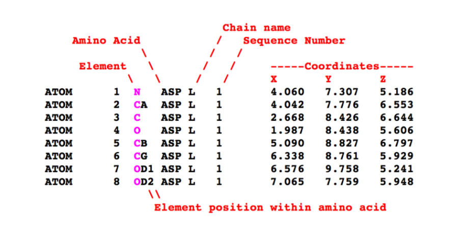
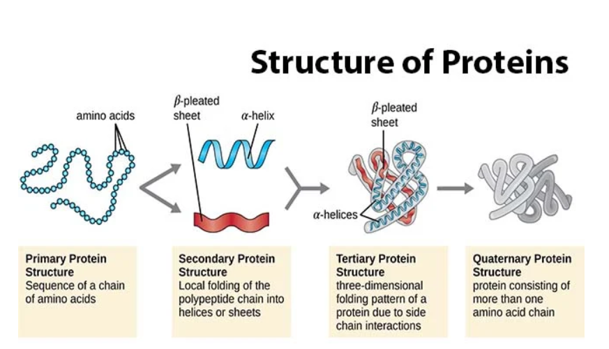
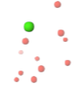

# 1. Introduction & Background
## AI and structures: from games to molecules

Click on the video below!

## The protein folding problem & the CASP competition

Proteins are responsible for our entire biological functioning and health. Since a protein's function is determined by its shape, misfolded proteins can cause a wide range of diseases. Understanding how proteins fold is essential to scientific discovery, helping researchers design drugs, engineer enzymes, and better understand our biology. To bring together scientists around the world to solve this problem, the CASP (Critical Assessment of Techniques for Protein Structure) Competition provides an opportunity for the creation of novel protein folding models, most notably, AlphaFold in 2018. 

## What are Protein Structures?

The single most important concept to remember when dealing with proteins is:

**STRUCTURE = FUNCTION**

Most of what we deal with in Biomolecular Design is protein structures. Whether we're dealing with enzymes, drugs, receptors, or any other protein--we're usually on a mission to understand the structure of our target molecule. This is because once we understand a structure, we can either a) predict its resulting function or b) modify the structure to achieve a desired function.

### 1. How Are Protein Structures Determined?

Researchers use three main techniques to determine the structure of proteins - 

- **X-ray Crystallography** - A crystal is made purely from the protein of interest and frozen with liquid nitrogen. A supercollider focuses a narrow beam of energy at the protein crystal, which diffracts the beam based on the specific atomic configuration of the protein. This specific pattern can be further analyzed to determine the 3D layout of the atoms and, therefore, the 3D structure of the protein. 
- **Nuclear Magnetic Resonance Spectroscopy (NMR)** - A pure protein sample emits NMR spectra, which are recorded and analyzed, creating a graph of peaks where each peak correlates to the distance between two types of amino acids. Further computational analysis is needed to interpret these peaks and uncover the true structure of the protein. 
- **Cryogenic electron microscopy (Cryo-EM)** - An electron microscope determines the 3D structure of a frozen protein. 

*X-ray Crystallography and Cryo-EM attempt to directly measure the locations of atoms, while NMR attempts to infer heavy-atom locations indirectly.

### 2. How to Interpret the Results? 

These techniques ultimately produce a file containing the relative X, Y, and Z locations of every **heavy atom** (every atom other than hydrogen) in the protein. The main type of file is called a **PDB File** (protein data bank file) and has a “.pdb” extension. In addition to detailing atom coordinates, PDB files also include information on the **residues** (amino acids) that make up the protein and metadata, such as experimental details (which technique was used to determine the structure). A labeled example PDB file is shown below.

Researchers developed visualization software to make these coordinates and labels come to life. A very common one is **VMD** (Visual Molecular Dynamics), which excels in visualizing multiple protein conformations and animating protein mechanisms. Another user-friendly program is **ChimeraX**, which is well-suited for quick visualization and image capture. Once a PDB file is uploaded to the program, it will display the full protein structure, allowing for further analysis.

### 3. Understanding a 3D Protein Structure 

While a 3D structure of a protein is much clearer than the information in the PDB file, it is still an abstract representation that needs further explanation. Proteins have four main structural states shown below - 

When viewing a 3D structure from a PDB file, you are visualizing either the **Tertiary Protein Structure** (a complete protein chain) or the **Quaternary Protein Structure** (multiple protein chains bound together). The chain number is usually indicated by a header in the PDB file, and the chain number column indicates whether the protein is chain 1, 2, 3, etc. An extremely simplified tertiary structure is shown below, representing what you’d typically see in visualization software. 

The protein structure begins at the **N-terminus** and ends at the **C-terminus**. These names originate from the start and end of an amino acid if read left to right. As the image above shows, if the chemical formula of a protein is composed of repeating amino acids, then the left side would end in an amino group (**N**H2) and the right side would end in a carboxyl group (**C**OOH). This is where the “N” and “C” labels come from.
As you traverse the protein sequence, visualization software depicts each structural segment of the protein in either three shapes - 
1. **Helices** (orange) - rigid spring-like shapes 
2. **Sheets/Strands** (blue) - rigid straight lines, sometimes with arrows
3. **Coils/Loops** (grey) - thin strings that represent all other amino acids. They have few hydrogen bonds and are highly flexible segments of the protein

In addition to the 3D structure of the protein, visualization software also depicts other molecules included in the PDB file.

1. **Ligands** - any molecule (drug, substrate, signaling molecule, etc.) that interacts with the protein. 

2. **Ions and Water** - included in PDB files if they play a role in the protein’s folding, stability, or dynamics. They could interact with the amino acids of the protein via hydrogen bonds or electrostatic forces. Water molecules are typically represented by small dots, while other ions are depicted as larger, colored dots. 

All these components come together to create a typical 3D model of a protein. 

### 4. Where to Access These Models?

Once the structure of a protein is experimentally solved, researchers upload it to the **Protein Data Bank** (PDB), a global repository for protein (and nucleic acid) structures. Each PDB entry has a unique 4-character alphanumeric ID. PDB files for certain structures can be downloaded from the PDB and utilized for various research purposes, such as molecular dynamics simulations and AI-driven structural changes. 