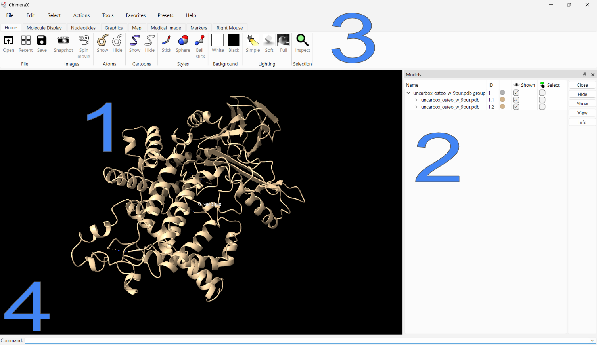

# 2. Visualization of Protein Structures

To actually visualize the PDB files, we must open them in one of these programs:

## Protein Visualition Programs
- [VMD](https://github.com/alyssablood/Biomolecular-Design-with-AI-Perez-Lab/blob/main/2.%20Visualization%20of%20Protein%20Structures.md#vmd)
- [ChimeraX](https://github.com/alyssablood/Biomolecular-Design-with-AI-Perez-Lab/blob/main/2.%20Visualization%20of%20Protein%20Structures.md#chimerax)

### VMD Tutorial

working

### ChimeraX Tutorial

[ChimeraX](https://www.cgl.ucsf.edu/chimerax/) is another visualization program that is more user-friendly than VMD. 

Go to [this page](https://www.cgl.ucsf.edu/chimerax/download.html) to download ChimeraX and follow the installiation instructions based on your system (Windows, Mac, etc). Once fully installed, open it up.

To open a PDB file that was downloaded onto your computer from the PDB, click on -
>File → Open → PDB_file

This will load the model and bring you to a screen that looks like this (may vary depending on the version and device operating system) - 

1. **The Model**: This is the visual representation of the PDB model you uploaded. You can click and hold onto it to spin it around and zoom in and out.

2. **Models Sidebar**: This menu shows what models are loaded and what they're labeled as. Instead of typing commands with the long name, you can refer to them by their ID number. You can also choose what color you want the models to be, control their visibility with the eyeball checkbox, and select them in this menu.

3. **Main Toolbar**: This menu has a variety of essential action buttons that are easier to use than typing commands. 

4. **Command Line**: This is a command line that functions very similarly to the main Command Line Interface on your device, except it has special ChimeraX syntax. It can be used for any action, but I only use it when I’m unable to achieve the action through the main toolbar. 

Now that we are comfortable with the setup, let's go through basic actions - 

- [Selecting](https://github.com/alyssablood/Biomolecular-Design-with-AI-Perez-Lab/blob/main/2.%20Visualization%20of%20Protein%20Structures.md#selecting)
- [Colouring](https://github.com/alyssablood/Biomolecular-Design-with-AI-Perez-Lab/blob/main/2.%20Visualization%20of%20Protein%20Structures.md#colouring)
- [Changing Surface](https://github.com/alyssablood/Biomolecular-Design-with-AI-Perez-Lab/blob/main/2.%20Visualization%20of%20Protein%20Structures.md#Changing-Surface)
- [Labeling](https://github.com/alyssablood/Biomolecular-Design-with-AI-Perez-Lab/blob/main/2.%20Visualization%20of%20Protein%20Structures.md#Labeling) 
- [Sequence Viewing](https://github.com/alyssablood/Biomolecular-Design-with-AI-Perez-Lab/blob/main/2.%20Visualization%20of%20Protein%20Structures.md#Sequence-Viewing) 
- [Structural Alignments](https://github.com/alyssablood/Biomolecular-Design-with-AI-Perez-Lab/blob/main/2.%20Visualization%20of%20Protein%20Structures.md#Structural-Alignments)
- [Editing PDB Files](https://github.com/alyssablood/Biomolecular-Design-with-AI-Perez-Lab/blob/main/2.%20Visualization%20of%20Protein%20Structures.md#Editing-PDB-Files) 

#### Selecting 

In ChimeraX, you can select atoms, **residues**(amino acids), chains, or everything. Selected items show up with a green outline. For basic selection, you can hover your mouse over the part of the model you want to select and then hit
> ctrl, mouse click
If you click on a model, the residue under your mouse will be selected. To select the whole model, keep clicking the “up” key until the whole model is selected. If too much is selected, hit the “down” key. 
For deselection - 
>ctrl, mouse click over blank space

For more specific selection, go to the “select” drop-down at the top of the screen.
By selecting “Chains,” you can select whole chains 
By selecting “Residues,” you can select specific amino acids
By selecting “Structure,” you can select specific ions and ligands
Let's say you want to select all amino acids involved in the active site of a protein. Once you have the ligand of interest in your selection, hit the “zone” button and specify the radius in angstroms around the target (5A is usually fine). After hitting Apply, a zone around the target will become selected. 

To save a selection, go to 
>Select → Define Selector… 
Then give it a name and hit apply. The selection will be saved in Select → User-Defined Selections.

#### Colouring 

If you want to change the color of a selection, select from the drop-down menu with - 
>Actions → Color

#### Changing Surface 

If you want to make a certain selection invisible, go to 
>Actions → Surface → Hide
Hitting show after will make it visible again

If you want to make the cartoon appearance a space filling model for better visualization of a binding pocket or to distinguish different domains of a protein, go to - 
>Actions → Surface → Solid

#### Labeling 

Once you are confident you have the right selection and want to know what amino acids are present, or if you want to make a well-labeled image for a paper, label aspects of the model with - 
>Actions → Label → Residues → Name and Number

You can modify this labeling as needed. 

#### Sequence Viewing 

To view the amino acid sequence of a model, go to 
>Tools → Sequence → Show Sequence Viewer 
Then select the chain that you want to view. This will show an interactive tab of the amino acid sequence. You can click and drag a range of amino acids and make selections from there. 

#### Structural Alignments

If you have multiple chains or models in a session, you can superimpose them to find structural similarities/differences with -
>Tools → Structural Analysis → Matchmaker
In the menu, select the bullet point: Best-aligning pair of chains between reference and match structure. This aligns the structure of one or multiple models to the reference structure you choose. Click the 'Apply' button below, and then click 'OK' to complete the superimposition. 

#### Editing PDB files 

Often in protein design programs or simulations, ions and non-structural ligands must be removed from the PDB file so they don’t interfere. These can easily be edited out of a PDB file in ChimeraX. To remove all water molecules, you can type - 
> delete solvent

Into the command line. 

If you want to delete all ligands in the session, type - 
> delete ligand

Into the command line.

To delete something more specific, select it however you prefer and then type -
>delete selection 

Into the command line. 

To delete an entire chain of a model, type -
>delete #1/A 

Into the command line (depending on what chain of what model you want to remove)

Once you are satisfied with what you see on your screen, you can save a new PDB file with -
>save C:\Users…\Downloads\new_name.pdb 

