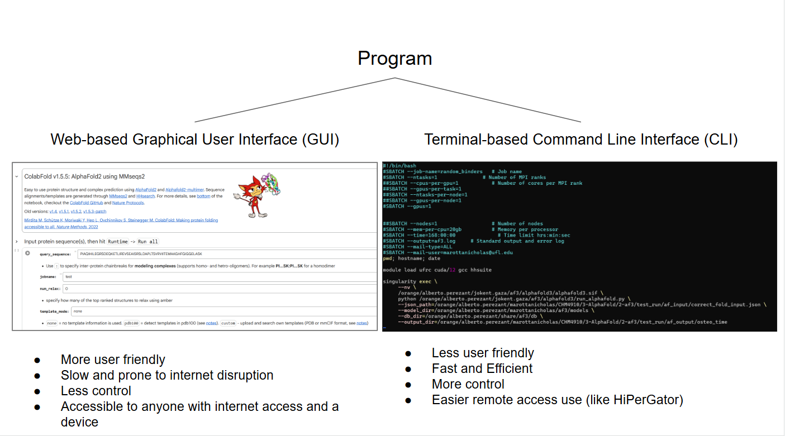
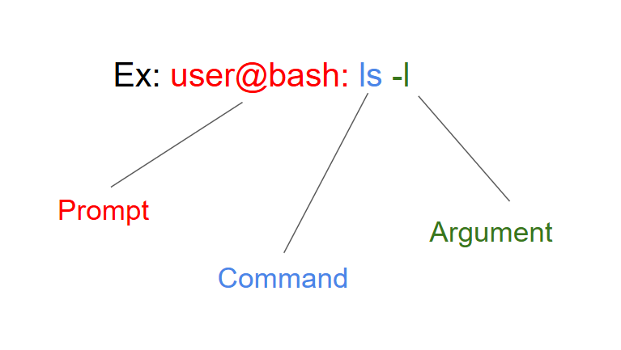
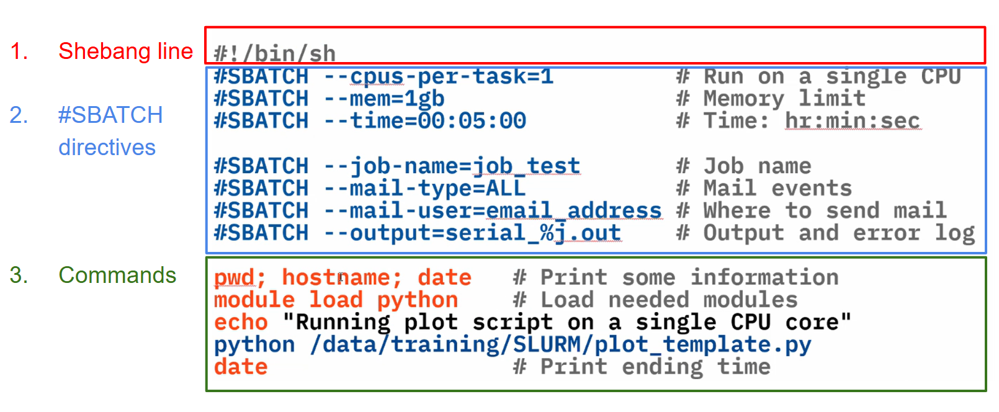
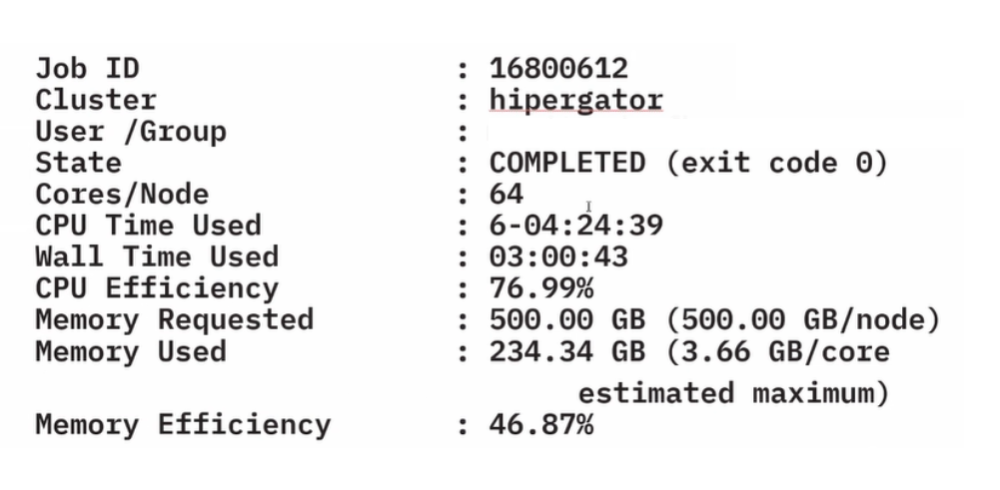

# 3. Core Technical Foundations

There is a wide variety of computer programs, both physics-based and AI-based, that utilize the 3D structures of proteins discussed in Tutorial 1 for research purposes such as protein structure prediction, protein redesign, or de novo generation (design from scratch), and protein interaction prediction/modeling. Learning how to use these programs is extremely important, and their foundation rests on two different methods. Software can either be run through the web, typically through Graphical User interfaces (buttons and visuals), or it can be run through a computer’s command prompt (Terminal for Mac/Linux or PowerShell for Windows) through command line interfaces (words). 

We will now walk through how to use both methods. 

## 1. Web-based Graphical User Interfaces
### Python/Colab notebooks for running AI pipelines
The majority of programs in molecular biology have a **Google Colab** page, which is a free, cloud-based service provided by Google that allows users to write, execute, and share Python code through a web browser. Developers of software or even just the community create these pages on Google Colab for anyone to use and become familiar with the program. Since they rely on graphics and buttons, they provide a more user-friendly way to use a program. 

## 2. Terminal-based Command Line Interfaces

Since most jobs in molecular biology require a large amount of jobs to be run, more control and precision over a program’s settings, and a large amount of resources, most researchers run programs in a command line interface on their computer’s command prompt. Since the interface is not as user-friendly and has a steep learning curve, the majority of this tutorial will focus on this method of running a program. 

### I. Command Line Fundamentals

#### A. Moving Around
Paths specify a location (file or directory) in the system:
- **Absolute paths** specify a location relative to the root directory (/) and always begin with a forward slash (/). For example - /orange/professor/user/data. 
- **Relative paths** specify a location in relation to the current directory and will not begin with a slash. For example - ./data
  - The tilde ~ represents the home directory.
  - The single dot . represents the current directory.
  - The double dot .. represents the previous directory (the directory containing the current working directory).

#### B. Commands
The Command Line (Terminal/PowerShell) is the interface used to execute commands on a computer.  A typical command line entry follows the structure:  Prompt: Command Arguments


- **Prompt** (e.g., user@bash:) - This is the prompt the *computer* gives you when you open the interface
- **Command** (e.g., ls) - This is the phrase *you* tell the computer to do
- **Arguments** (e.g., -l) - These further define what you want the computer to do. The first argument is called the **Option**. 

It is crucial to have spaces between each command and its arguments. A backslash \ character can be used to continue a line, which helps make complicated input more readable. Multiple commands can be run simultaneously using the UNIX "pipe" operator |. A list of essential commands and their functions is listed below:
- **pwd = print working directory**
  >$ pwd

  Tells you what your current or present working directory is and the path you took 

- **cd = change directory**
  >$ cd /orange/professor_name/your_name/folder1

  This command is used to navigate into/out of folders from the command line.

  Note: **$ cd ../** will go backwards a directory.

  So if you're in folder1 above, and type **cd ../../** then you will be in professor_name folder.

  If you do not specify an argument, it will bring you to the home directory.


- **ls = list**
  >$ ls

  This feature will print a list of all files and folders stored at the location you are currently in.

  Note: **$ ls -l** will also print advanced data such as file size and ownership. 
  **$ ls -R** recursively lists all subdirectories and each path


- **mkdir = make directory**
  >$ mkdir directory_name

  In terminal, a directory is what you would normally call a folder. This is a new location to store your files.
**$ mkdir -p** allows you to make a directory and subdirectory in one shot - tells mkdir to create any needed "parent" directories as it goes (ex: mkdir -p parent_folder/folder)


- **rm = remove**
  >$ rm -rf directory_name

  This command deletes (or removes) the specified directory. The **-rf** addition is important in order to give it permission to also delete folders that are _not_ empty.

- **mv = move**
  >$ mv path/to/starting/location path/to/ending/location

  This command moves files from one location to another.

- **cp = copy**
  >$ cp path/to/starting/location path/to/ending/location

  This works the same as **mv**, but it does not modify the original file.

- **vi = visual**
  >$ vi file_name

  This command is used to open (or visualize) a file. 

  Note: once the file is open you must either **:q** = quit, **:q!** = quit without saving, or **:wq** = write and quit (save changes).
- **cat = concatenate**
  >$ cat file_name

  Shows contents of a text file on screen (name of file is the argument)
- **head = top of document**
  >$ head file_name

  Shows the first few lines of textfile. **-n** argument lets you indicate how many lines you want to see (ex: n=2 means first 2 lines). 
- **tail = bottom of document**
  >$ tail file_name

  Shows the last few lines of textfile. Same arguments as 'head' 
- **grep = global regular expression print**
  >$ grep pattern file_name

  Shows a specific section of a textfile indicated as the option (first argument). 
- **git clone = clones github repository**
  >$ git clone repository_url

  This command duplicates a github repository at the given url to your current location.

### II. Introduction to HiPerGator for scalable computing

#### A. Logging in and Navigation

Another major benefit of using a command line interface is the ability to access high-speed computers remotely from your own computer. UF is proud to have the fastest supercomputer in higher education, HiPerGator, which is accessible to any researcher with an account. Any UF student can apply for a HiPerGator account here with a faculty advisor - https://www.rc.ufl.edu/get-started/hipergator/request-hipergator-account/. To access HiperGator, use the Secure Shell (SSH) command on your computer’s command line - 
```
ssh user@hpg.rc.ufl.edu
```
replacing "user" with your username chosen when creating a HiPerGator account. 
After following the logging in process with your password and a duo push, your computer gains remote access to HiPerGator, putting you in a login node (ex: [marottanicholas~]$). This is your home directory, a space limited for file and job management purposes, with a maximum of 16 cores, 64GB of memory, and a 10-minute job limit. Jobs are not run here. If you run a job that requires more than these resources, your HiPerGator account will be temporarily suspended. Jobs are typically run in the blue directory. Scripts and programs are typically stored in the orange directory. 


#### B. Job Scripting and Submission

Once inside HiPerGator, navigate to your orange directory - 
```
cd /orange/professor_username/your_username
```
This is where you can install and run your programs. To install a program, search for it on **GitHub** (https://github.com ) and click on the green code box. Copy the link in the HTTPS box and paste it as an argument with this command
```
git clone ex_link
```
This clones the repository for the program from Github into your orange directory, essentially downloading the program. After reading through further installation instructions on the GitHub Page, the program is ready to run. 

The preferred method for running a job on HiPerGator is through sbatch scripting. HiPerGator is controlled by a **Slurm (Simple Linux Utility for Resource Management) Workload Manager**, which is a system that keeps track of resources (CPUs, memory and GPUs) your job needs and for how long it will use those resources. Its goal is to keep everyone’s jobs running as optimally as possible without depleting all resources in a group. To work within this system, you must submit a slurm/sbatch script that is processed by the SLURM scheduler and then pushed through depending on resource availability. 

To create a Slurm script, use this command - 
```
vi ex_slurm_script.sh
```
The vi command opens a text editor and creates the file. The ‘.sh’ at the end of the file name just indicates it is a Slurm file. Once the file is created, you can control the document in two modes - command mode and insert mode. You automatically start in command mode, but to actually write in the document, you must switch to insert mode, which can be done by typing ‘i’. At the bottom left corner of the screen, it should say insert. This is how you know you can start typing in the document. 

Writing a Slurm script correctly is essential. A typical Slurm script is composed of the three sections shown below - 



The file must begin with a Shebang line (#!/bin/sh)  so that the operating system's kernel knows what interpreter (like bash, python, or perl) the rest of the file is written in. Typically on HiPerGator, we use a bash interpreter. By specifying this in the very beginning, you are now able to use bash commands from above in your slurm script. 

Next, you must specify #SBATCH directives that inform the SLURM scheduler of the resources required. At the bare minimum, you must specify the CPUs, memory and time, which are the first three directive lines in the template script above. 


To specify CPUs, first determine if the job can utilize multiple CPU cores or if the application requires GPUs. If so, determine whether it can use only one or multiple GPUs. This can be specified as in the template above by simplifying switching “cpu” to “gpu”. 

Memory (RAM) can be specified in the following two ways:

- -- mem=1gb (total memory)
- -- mem-per-cpu=1gb (memory per core)
  - Can use mb or gb
  - No decimal values: use 1500mb, not 1.5 gb
  
  Users should request the amount of memory their application will use, leaving a buffer of 15-20%, and should avoid requesting excessive memory.

Time can be specified in the following formats: 
-- time or -t
- 120 (minutes)
- 2:00:00 (hh:mm:ss)
- 7-0 (days-hours)
- 7-00:00 (days-hh:mm)
- 7-00:00:00 (days-hh:mm:ss) 

It is good practice to request 15-20% more time than the application is expected to run, as the scheduler reserves resources for the requested time.

An important directive not shown in the template above is Quality of Service (-- qos). This directive tells the Slurm scheduler which group’s resources to use for the job. Typically, this is not needed if you are performing research within your own group, but if you are doing research for another group and need to use their resources, like for the UF iGEM team, for example, then you must specify this directive to prevent the job from using your faculty mentor’s resources. Each group has 2 QOS options 
- Investments QOS: -- qos = group
- Burst QOS: burst capacity, available when idle resources are available on the cluster --qos=group-b
To use QOS, specify these two lines in the Slurm script with the name of the group whose resources you want to use -
```
#SBATCH --account=group_name
#SBATCH --qos=group_name
```

Once all the directives are specified, now you can write the body of the Slurm script, which contains all commands necessary to actually run your program. This segment looks vastly different for each Slurm script but there are still some things consistent. 

Most programs require the activation of certain modules on HiPerGator to run. This can be done using the 'module load' command (as seen in the template above) - 
```
Module load example_module
```

If you don’t know the specific module(s) your program needs to run, use the 'module spider' command to find them on the command line -

```
Module spider example_program
```
If the program you specify is compatible with HiPerGator, a list of modules needed will be printed to the screen. Then, use ‘module load’ in the Slurm script to load these modules so that the program can run correctly. 

After specifying everything for the job, you can save the Slurm script by exiting insert mode (esc key) and type ‘:w’ to save and ‘:q’ to exit. To submit the job to the Slurm Scheduler for execution, use the command -


	sbatch slurm_script.sh


This will submit the job and print a confirmation line with the job ID. 

To monitor your job, you can enter the command - 
```
squeue --me
```
This will print a table of the job's status, most importantly showing how long the job has been running or if it is still in the queue. The job is completed (or failed) when all the titles are cleared. 

If you specified your email as an #SBATCH directive, an email will be sent to you when the job starts and ends. The information contained in the email is shown below - 

If the job fails for any reason, it will print here. If the problem is due to an unavailability of resources, you can check your quotas depending on storage location with these commands - 
- Home directory: home_quota 
- Blue storage: blue_quota
- Orange storage:  orange_quota 

For more information on HiPerGator, click on this link: https://docs.rc.ufl.edu/ and view the tutorials. 

