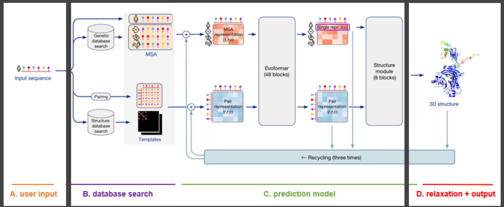
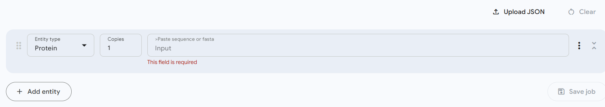
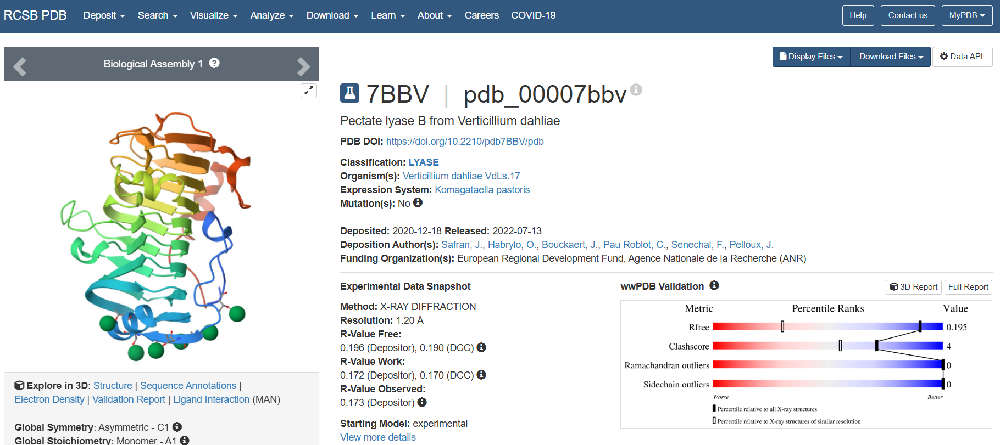
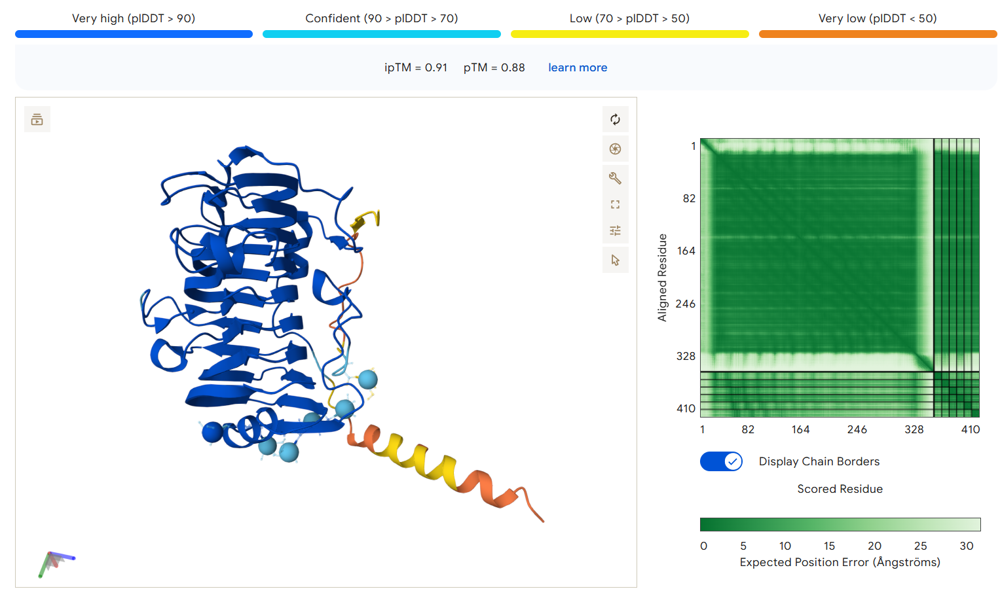
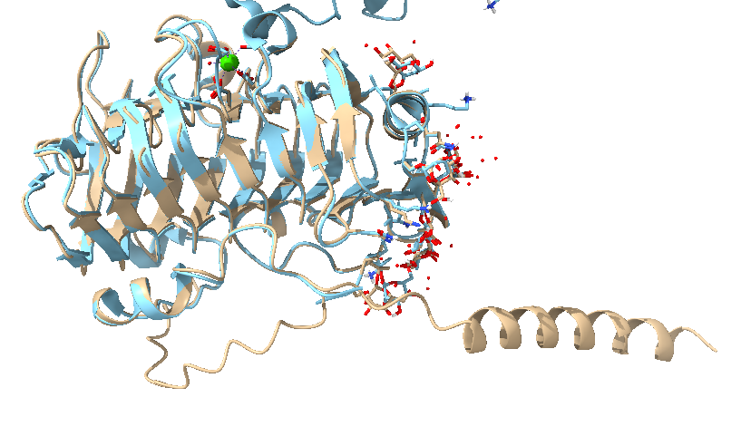

# 3. Protein Structure Prediction

Since a protein's entire role in the body is controlled by its structure, researchers have been studying the protein folding process and trying to simulate it computationally. Through such simulations, scientists can not only better understand what impacts the folding and structure of a protein, but also fold de novo (new) proteins and test their capabilities computationally before using resources in the wet lab. 

## Protein Folding Programs
  - [**AlphaFold2**](https://github.com/alyssablood/Perez-Lab-Intro-Tutorials/blob/main/5.%20Protein%20Interactions.md#alphafold-competitive-binding-assays-af-cba): Extremely popular tool for deriving a 3D structure from an amino acid sequence. Very high accuracy, industry standard. You can read the AlphaFold official paper [here](https://www.nature.com/articles/s41586-021-03819-2).
  - [**AlphaFold3**](https://github.com/alyssablood/Perez-Lab-Intro-Tutorials/blob/main/5.%20Protein%20Interactions.md#alphafold-competitive-binding-assays-af-cba): Expansion of AlphaFold2 that also analyzes interacions between molecules. This program won 2024 Nobel Prize in Chemistry. You can read the AlphaFold3 official paper [here](https://www.nature.com/articles/s41586-024-07487-w).
  - **RoseTTAFold**: Similar to AlphaFold, RoseTTAFold uses Multiple Sequence Alignments (MSAs) and templates for high accuracy. You can read the AlphaFold3 official paper [here](https://www.ipd.uw.edu/wp-content/uploads/2021/07/Baek_etal_Science2021_RoseTTAFold.pdf).
  - **ESMFold**: Unlike AlphaFold and RoseTTAFold, ESMFold prioritizes speed and scalability by avoiding MSAs and utilizing the internal knowledge of large protein language models trained on vast protein sequence data. It is excellent for exploring vast sequence spaces and producing many models quickly. You can read the ESMFold official paper [here](https://www.science.org/doi/abs/10.1126/science.ade2574).
  - [**AMBER**](https://github.com/alyssablood/Perez-Lab-Intro-Tutorials/blob/main/6.%20Protein%20Dynamics.md#beyond-static-folds-ensembles-and-motion): Uses physics-based (p-chem) methods to apply [force fields](https://en.wikipedia.org/wiki/Force_field_(chemistry)) (vector equations) to molecules in order to predict folding, docking, and general behavior. Good for very specific results, binding energy and other outputs are considered reliable. AMBER's homepage and tutorials are linked [here](https://ambermd.org/index.php).

## How Do They Work 

While each program works differently, the concept of predicting protein structures can best be seen through the AlphaFold architecture -

Like all neural-network-based AI programs, AlphaFold has an **Input**(protein sequence), a **Hidden Layer** where all the folding takes place, and an **Output** (protein structure).

In the Hidden Layer, the amino acid sequence is compared to other amino acid sequences in the Protein Data Bank (PDB), and a **multiple sequence alignment (MSA)** is performed to see what amino acids are conserved (the same across multiple sequences) as well as the general patterns displayed. At the same time, the input amino acid sequence is also searched for structures in the PDB, and the same alignment method is used to compare similar structures and find patterns. This is shown in the "B. database search" in the image above. These patterns are then fed to the Evoformer, combined, and used to generate an initial structure, as shown in the "C. prediction model" in the image above. However, this structure is very poor and usually doesn't represent a structure that would exist in the real world. So, the prediction process is recycled three times, yielding the final protein structure.

## Alphafold Tutorials 

### Graphical User Interface (GUI) Tutorial with AlphaFold Server

AlphaFold has a server to easily run jobs with a graphical interface as a user-friendly alternative to running the program in terminal. 

Go to https://alphafoldserver.com/welcome and click continue with google

You can read the information at the top of the screen, but the input section looks like this - 

 	 

In the *Input* box, you can paste the amino acid sequence of the protein you are trying to fold. 

For this tutorial, you can click on one of AlphaFold’s examples, Protein-Glycan-Ion: PDB 7BBV. Notice how after clicking the button the information auto-fills the input bar. In this example, there are 2 entities - the protein and the Ca Ion. By typing the PDB code 7BBV into the PDB (https://www.rcsb.org/) we can see that the protein is a Pectate lyase, which is a protein that degrades complex polysaccharides and major components of the plant primary cell wall, mainly used in the food industry. The PDB page for this protein also shows what its predicted structure should look like, as solved by X-ray diffraction. 

 

Hit the “continue and preview job” button and then “confirm and submit job”. The job should run very quickly since it is an AlphaFold example

Click on the name of your job at the bottom of the screen in the table  - “Protein Protein-Glycan-Ion: PDB 7BBV.” 

You should now see the AlphaFold predicted structure of the protein. Notice the confidence bars above the model. These are measured in **plDDT** ( predicted Local Distance Difference Test). Since the model is mostly colored in blue, AlphaFold is very confident in this structure. This can be seen by visually comparing the AlphaFold output with the experimental structure in the PDB. They are highly similar, except for a random, low-confidence helix jutting out from the main protein. Note that your protein structure may look slightly different from mine, as AlphaFold incorporates random elements into its architecture and input processing. 

But how different are these two models? 

To figure this out, we must perform a **Structural Superposition** with visualization software. For this tutorial, I will choose ChimeraX. 

First, hit the download button above the AlphaFold output model and download the files to a preferred location. Then, extract the files. 

Open up ChimeraX and open the model examplefold_pdb_7bbv_model_4 (AlphaFold always produces 5 total, so we’ll randomly choose the last one). 

>File → Open → examplefold_pdb_7bbv_model_4

You should now see the model shown on the AlphaFold server

Open the Command Line Interface if it isn’t there already

>Tools → Command Line Interface

Open the experimental PDB model 7bbv through the command line and hit enter

> open 7bbv

You should now see 2 differently colored models in ChimeraX (the models sidebar labels the 2 models) 

Perform a structural alignment

>Tools → Structural Analysis → Matchmaker

In the menu, select the bullet point: Best-aligning pair of chains between reference and match structure

This aligns the structure of one model to the reference structure, which will be the experimental 7bbv (#2) model. Since there are only 2 models, it does not matter which model is in the reference structure or structure(s) to match boxes at the top of the menu, but this would be important if there were more. 

Click the 'Apply' button below, and then click 'OK'. You should now see the two models overlaid on top of each other. You can now clearly see which regions of protein are the same (overlapping of blue and tan) and which regions are different. 

### [Docking](https://github.com/alyssablood/Perez-Lab-Intro-Tutorials/blob/main/5.%20Protein%20Interactions.md#docking-methods)
  - Docking programs can be very similar to protein dynamics, however they are not capable of predicting mechanisms as they do not consider time-dependant factors. They are used primarily to predict final docked conformations.
  - [**AutoDock**](https://github.com/alyssablood/Perez-Lab-Intro-Tutorials/blob/main/5.%20Protein%20Interactions.md#docking-methods): Predicts how ligand and protein interact, and what binding conformation would occur. P-chem methods are NOT used, therefore specific numbers are considered unreliable. Good for preliminary testing to get shape and quantity of docked poses. An overview of the AutoDock suite's capabilities can be found [here](https://pmc.ncbi.nlm.nih.gov/articles/PMC4868550/).

## [Protein Design](https://github.com/alyssablood/Perez-Lab-Intro-Tutorials/blob/main/4.%20Protein%20Design.md#4-protein-design)
  - [**BindCraft**](https://github.com/alyssablood/Perez-Lab-Intro-Tutorials/blob/main/4.%20Protein%20Design.md#bindcraft-and-other-emerging-methods): Good for desiging a new binder custom fit to a target protein. It is generally very accurate, but follows strict garbage in garbage out policy. Input protein must be high accuracy, and runs take a relatively long time. You can read the BindCraft official paper [here](https://www.nature.com/articles/s41586-025-09429-6). Click [here](https://github.com/alyssablood/Perez-Lab-Intro-Tutorials/blob/main/8.%20Community%20Challenges%3A%20unbiased%20assessment%20of%20methods.md#igem-projects-on-campus) to see how UF's undergraduate synthetic biology team (iGEM) is used BindCraft for deep space travel research!
  - [**ProteinMPNN**](https://github.com/alyssablood/Perez-Lab-Intro-Tutorials/blob/main/4.%20Protein%20Design.md#rfdiffusion-and-proteinmpnn): Optimizes amino acid sequences for most stable protein backbones. Good for designing new target proteins. You can read a paper introducing ProteinMPNN [here](https://www.science.org/doi/10.1126/science.add2187).
  - [**RFDiffusion**](https://github.com/alyssablood/Perez-Lab-Intro-Tutorials/blob/main/4.%20Protein%20Design.md#rfdiffusion-and-proteinmpnn): Generates new protein backbones using diffusion models. Adds in noise to allow for flexibility in folding. Results MUST be checked carefully. It is very easy to add too much noise and generate garbage outputs. You can read RFDiffusion's official paper [here](https://www.nature.com/articles/s41586-023-06415-8).

    Note: the RF in RFDiffusion stands for RoseTTAFold, which you can read more on [here](https://www.science.org/doi/10.1126/science.abj8754).

## Visualization
  - **Chimera**: Best for generating final graphics for presentations, models alpha helix versus beta pleats. Chimera tutorials can be found [here](https://www.cgl.ucsf.edu/chimera/tutorials.html).
  - **VMD**: Best for modeling multiple docking poses and animating mechamisms. Many options for color/shape of models. VMD tutorials can be found [here](https://www.ks.uiuc.edu/Training/Tutorials/vmd/tutorial-html/).
